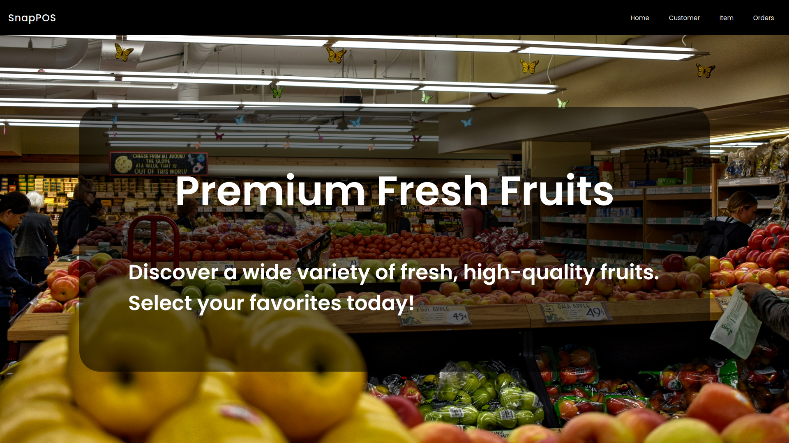
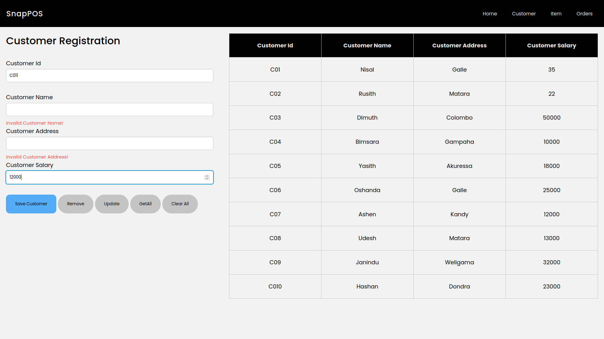
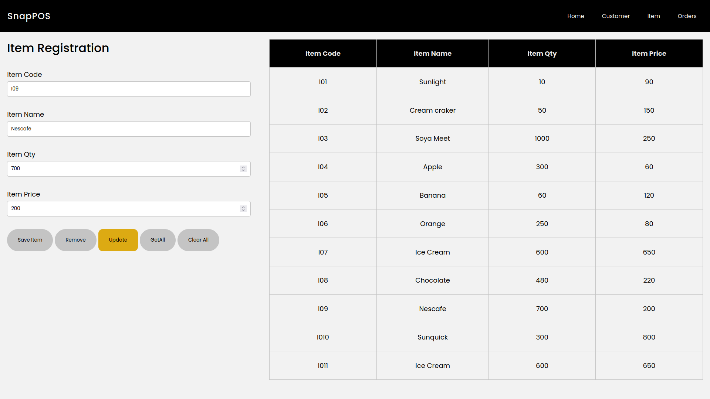
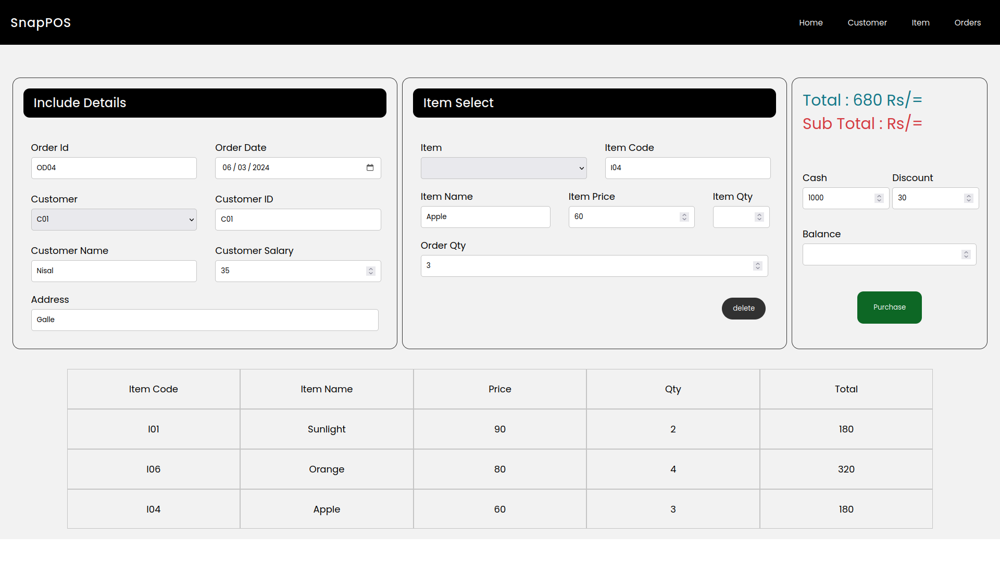

#  Simple POS Web

## Description

Simple POS Web is a straightforward, in-memory point-of-sale (POS) system designed for small businesses. 
The application features a user-friendly interface with pages for managing customers, items, and orders. 
This web-based solution enables efficient handling of customer data, and inventory management, making it ideal for shops and small retail businesses.

## Table of Contents

- [Features](#Features)
- [Visual_Insights](#Visual_Insights)
- [Usage](#Usage)
- [License](#license)

## Features

- Home Page: A carousel showcasing the shop's quality and key features.
- Customer Management: Add, edit, and manage customer details.
- Item Management: Add, edit, and manage inventory items.
- Order Management: Create and manage customer orders.

## Visual_Insights

### Home Page

### Customer Management

### Item Management

### Order Management

## Usage

<ol>
  <li><strong>Clone the Repository: </strong> Start by cloning the repository to your local machine.</li> 
  <li><strong>Practice and Experiment: </strong> Modify the code, create new options, and experiment with the concepts to solidify your understanding.</li>
</ol>

## License

This project is licensed under [MIT License](LICENSE).

##

  

  &copy; 2024 Gayanuka Bulegoda

